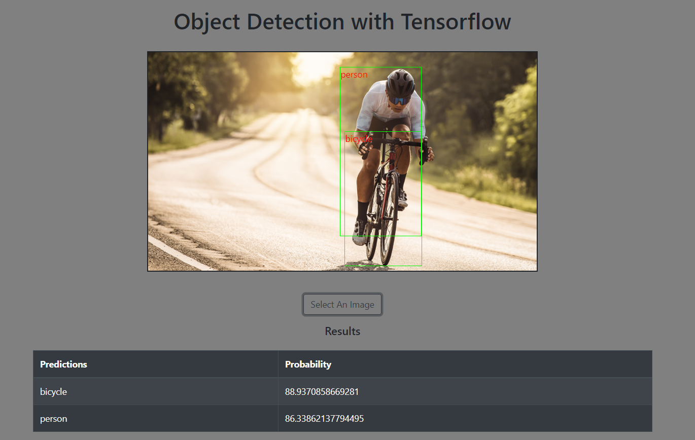
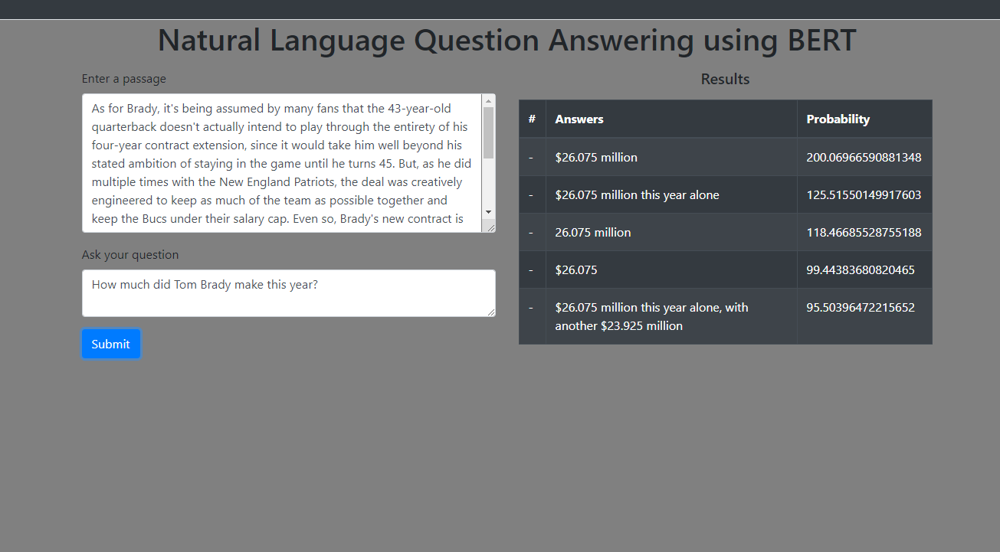

# README
Visit the application here on https://recogniz.herokuapp.com/
<h3>Technologies </h3> 
<ul> 
  <li>React</li>
  <li>Rails</li>
  <li>Postgres</li> 
  <li>Ruby</li>
  <li>tensorflow</li>
</ul>
<h3>Introduction</h3>
This is a simple project that was built to get familiar with uising rails and react on the frontend. It uses the 
tensorflow COCO-SSD and BERT models 

The how it works page is a description of the models used. That is self explanitory. The object detectection tab
on the sidebar takes and image and will accuratley predict what is in the image using a model 
from tensorflow.



The second model takes in any passage and allow you to ask question about it. I chose a passage about eliud
kipchoge for the example but it really can be anything. 



In the example above I ask the model about Tom Brady. Sometimes the model does not understand what the question is and the page does not notify the user when nothing is recognized. Feel free to contribute and fix this bug as I continue to work on it.

AI is not perfect...yet.

<h3>How to run</h3>
This project uses Ruby version 2.7.2. You can build the project by cloning the repository and 
running 
```
npm i 
rails server
```
Warning: The models are large and take a few seconds to load

feel free to fork the repository and contribute
